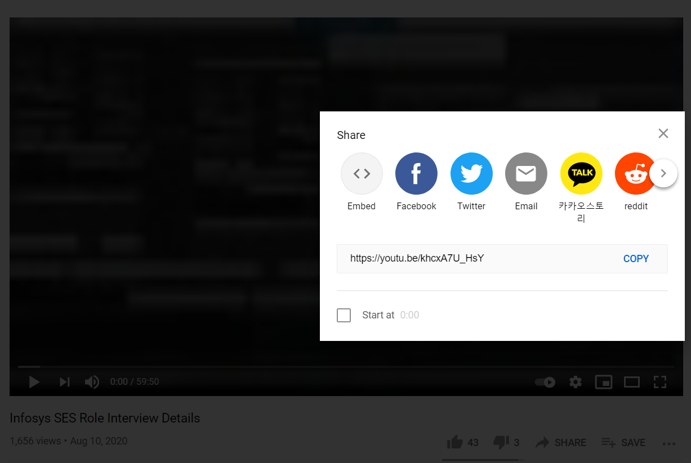

# HTML
***
Hypertext Markup Language
* Technology/Language used to create Webpages
* HTML Tags
* ".html" file Extension

 ## HTML Introduction
 ***
 __TEXT EDITOR__
Notepad vs VSCode

**hello.html**
```html
  <html>
  <head>
    <meta charset="UTF-8">
    <title>HTML</title>
  </head>
  <body>
        <h1>Hello WOrld!</h1>
        <p>Welcome To HTML Learning</p>
  </body>
  </html>
```

## HTML FILE
***
__Creating HTML File__
1. Create  a Folder __HTML__
2. Create a file __index.html__
3. ```html
   Hello World!
   ```
4. Basic Skeleton Of HTML File
  ```html
     <!DOCTYPE html>
     <html>
       
     </html>
   ```
HTML Document
<html></html>   Html Tag, Necessary for any html file
<head></head>    Data About the document, like title,discription,image,link etc
<body></body>
<p></p>           paragraph Tag, contains text
<title></title>   title Tag, conatin Title of website

__Browsers__
Browser is able to parse our websites and read the Tags & Figure out what is title, paragraph, image, link, heading, etc much more.

__Indentation, visually help us to decide the relationship between the TAGS__
__Parent Tag - Child Tag__

## HTML TAGS
***
Basic common HTML Tags:-
1. Meta Tag, a tag that define information  about our file.
   <meta charset="UTF-8">
   <meta name="description" content="This website do something for you">
   __Attributes or Properties__
2. Body Tag, All the stuff we see on the websites generally inside body tag
   ```
   <body>
   <h1> This is the Header</h2>  header tag, Header(h1,h2,h3,h4,h5,h6) of our website
   <p> This is paragraph</p>  paragraph tag, some text on websites
   <b> </b>   bold tag, style text as BOLD
   <i> </i>   itallic tag, style text as *itallic*
   <p> Welcome TO <b>HTML</b></p>
   <br/>  break tag, used for space
   <hr/> hrizontal role tag, basically give us a straight line that helps to seperate contents on websites
   <big> </big>
   <small> <small/> using big nad small tag we can controll our text size
   <sub> </sub> subscript tag H2O (Water)
   <sup> </sup> superscript tag 10^2 (100)
   </body>
   ```
   * **Order of Tags Matters in body Tag** The way we order tags, render by the browsers
   * **HTML doesn't care about white space** because it's only care out what is inside in their tags
   * **Single Tag** that has only one tag like <br/>, <hr/>
   
   ## HTML Comments
   ***
   
   - [x] **HTML Comments** are basically like Texts which is ignore by the Browers. 
   - [x] **Purpose of comments, Readability/Reminder of Code for ourself later or for others developers**
   - [x] ```<!-- 
           -->```
   > Note:- **COMMENTS, The best practice of Writing Code!** 
   
   ## Style & Color
   ***
   We can style HTML elements using **style** attributes through styling information\
   Basic Styling and set backround color to html elements
   ```
   <p style="color:blue;">  Applying color to paragraph.</p>
   
   <p style="background-color:red;">  Setting Background color</p>
   
   <body style="color:red;">   </body>
   
   <h1 style="background-color:lightblue;">Our Websites</h1>
   ```
   
   > **Styling HTML, We learn CSS Cascading Style Sheet later on.**
   
   | Color Name | Hex   |
   |------------|-------|
   | Black | #000000|
   | White | #ffffff|
   
   [Learn HTML](https://www.w3schools.com/html/ "link")
   
   
   ## Formatting a Page
   ***
   
   Using various HTML Tags  to Layout the Structure  of Website
   
   > **Using Right tags at Right Place is Important.**
   
   - [x] 1. __Header__ || Every websites has a header like **Website Name, Logo, Navigation Menu, Links**
   - [x] 2. __Main Section__ || Back-Bone, All the contents like **Article, Sections, Images** 
   - [x] 3. __Footer__ || Websites has also a footer like **Navigation link, Copyright Info, Social-Media links**
   
   
   **HTML has tags used to define all of these Header, Main and Footer**
   ***
   ```
      <body>
          <header>
                 <nav>
                       <!-- Naviagational Link, Naviagtional List Navigational Image/Logo-->
                       
                 </nav>
          </header>
          
          <main>
                <article>
                     <section>
                          <h2></h2>     
                     </section>
                     <section>
                          <aside>
                              <!-- Thhis content is on the page & getting shown to the users but it's not directly related to core content-->
                          </aside>
                     </section>
                </article>
          
          </main>
         
          <footer>
         
          </footer>
         
      </body>
   ```
   ***
   * **Side Tag**, basically a tag that does not directly related to main content of webpage
     Example- **Advertisement** like google adsense
   ***
   
  **Advantages of Using the Specific HTMl Tags**
  
  * Look and Feel
  * separate Section of websites.
  * Organised Code for anyone from the Organization use it.
  * Readability, easy to read the file
  * Structure the skeleton of website
  * Search Engine Optimization, when we use these html tags google could easily going to our file and figure-out where are the different sections.\
    Google can use this information to display website better.

  > **Search Engine Optimization**, basically how your websites is viewed by a search engines.
    Like Google
  > **Don't Ingnore the power of HTML Tags**
  
   Best Practice to define tag hierarchy
   ```
      h1
           h2
              h3
                 h4
                     h5
                       h6 h6
                     h5
                 h4
             h3
         h2
      h1
   ```
   
## Links
***
Using Links in HTML
* A Link is one of the most popular HTML Element, used to link a website to another website on the Intenet
Example- google.com
         linkedin.com
         another page of our own website
* Links are also used to link Navigational List, images, pdf etc

```
   <a href="https://www.google.com"> Google Home Page</a>
```

* When you do not want to redirect on that given link and open it up in new tab
```
<a href="https://www.google.com" target="_blank"> Google </a>
```
> Websites are not of a single webpage, Every websites has a number of webpages.

* Link to another pages of our websites
  Like: index.html
        contact.html
        about.html
        page2.html
 ```
   <a href="about.html"> About Us </a>
 ```
 **Here we only mention the file name because browsers already know this file is in the same directory.**
 
 ## Images
 ***
 Using Images on websites, basics of working with Images
 * Resizing Images
 * Placing on our HTML Pages
 __Image Tag___
 ```
      
 ```
 * One common problem with images are thier size differ, so we can resize Images.
 ```
      
 ```
 > **px, pixel is a unit of measurement of size depending on the resolution of the screen.**
 
 > __Note In addtion to both the width and height, we can set either height or width. By setting anyone of them HTML automatically adjust the aspect ration of height and width.__
  
  * __We can combine our images to a link__
  ```
     <a href="https://www.google.com">
        
     </a>
  ```
  
  ## Videos and YouTube iFrames
  ***
  Using **Videos from your device** + **Youtube Videos** on wensites
  
  ### Local Videos
     Working with file introduction.mp4
    ```
       <body>
           <video src="introduction.mp4"> introduction </video>
       </body>
    ```
  * Make video playable using **controls** property
     ```
          <video src="introduction.mp4" controls> introduction </video>
     ```
  * **Resize the frame of video using  height and width attributes**
    > ```
    >    <video width="300" height="200" src="introduction.mp4" controls> Introduction </video>
    > ```
  
  * We can add **Thumbnail/poster** to our video using **poster** attribute
    > ```
    >    <video width="300" height="200" src="introduction.mp4" poster="thumbnail.png" controls> Introduction </video>
    > ```
    
  * **Autoplay** **loopinging** video using **autoplay** , **loop** attributes respectively
    > ```
    >    <video width="300" height="200" src="introduction.mp4" poster="thumbnail.png" autoplay controls> Introduction </video>
    > ```
  
  ### YouTube Videos
   * Open any youtube video
       * Go to share option
             * clicked on Embed
                   * copy iframe code        
                 
  
  
